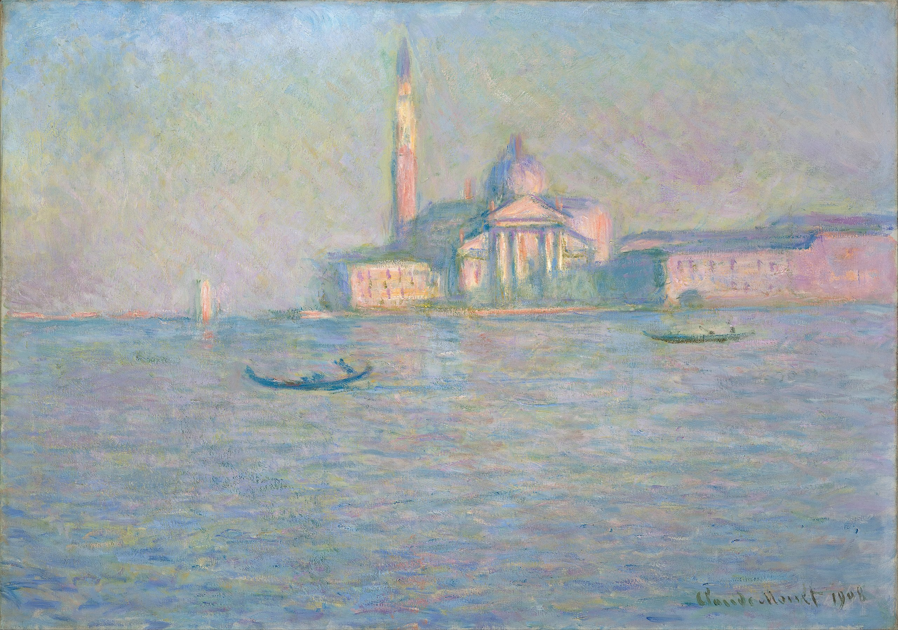

# Creative Coding Major Project: Functional Prototype
**Instructions:**Move the mouse slowly across the x-axis.

## Project Details
My functional prototype is driven by **user input**.
Moving the mouse across the x-axis results in a gradual change to the color gradients that are implemented in each shape.
This differs from other group members - Joyya is using timing events to alter line direction, and Boris is using Perlin noise to create wave-like animations in the river. 

## Inspiration
My functional prototype was inspired by the chosen artwork itself. *Saint Georges majeur au crépuscule* by Claude Monet is an Impressionist depiction of the island-monastery of San Giorgio Maggiore in Venice. This artwork forms part of a series of paintings that depict San Giorgio Maggiore in differing lighting conditions. 

This inspired me to explore a transition between these lighting conditions to create a dynamic line representation of the Monet's San Giorgio Maggiore series.

## Technical Explanation
My individual code uses a combination of color arrays, mouse interactivity (mouseX), for loops, the push() method, and easing (lerpColor) to achieve the desired animation.

I first used Photoshop to retrieve color codes for the sky/river and building/reflection in each lighting condition. I then implemented these color codes in separate **color arrays**.

I then created a **mouseXRatio** to return a normalised value between 0 and 1 for the mouse x-position:
`let mouseXRatio = mouseX / width;`

Next, I used a **for loop** to iterate through each element of the skyColors array:
`for (let j = 0; j < skyColors.length; j++) {`

I then used **easing** to interpolate between the old and new skyColor arrays based on the mouse x-position:
`let interpolatedSkyColor = lerpColor(skyColors[j], skyColors2[j], mouseXRatio);`

Finally, I used the **push() method** to add the interpolated color to a dynamic changingSkyColor array, which I then called upon when drawing the sky and river:
`changingSkyColor.push(interpolatedSkyColor);}`

This technique could be easily reiterated for the buildingColors.
